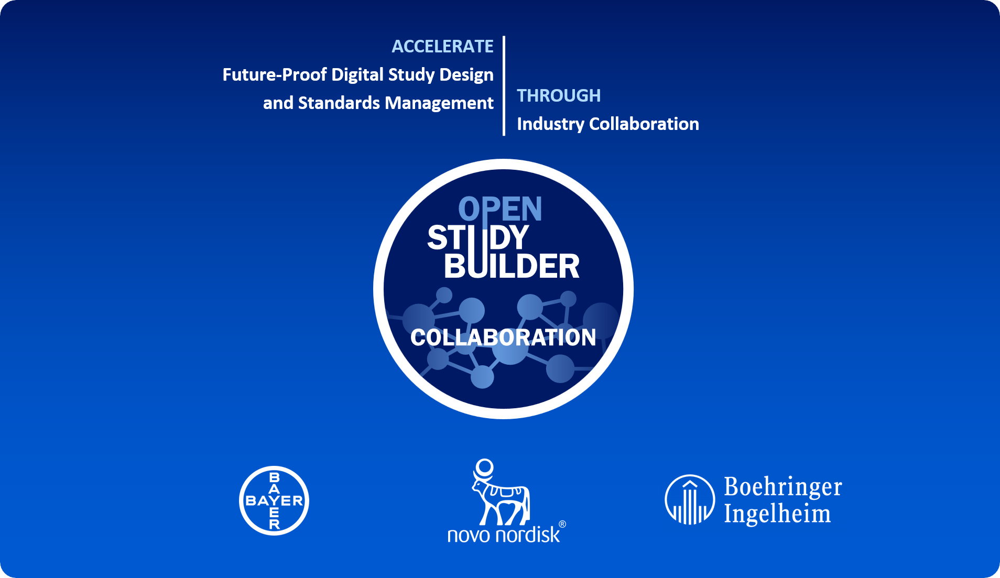
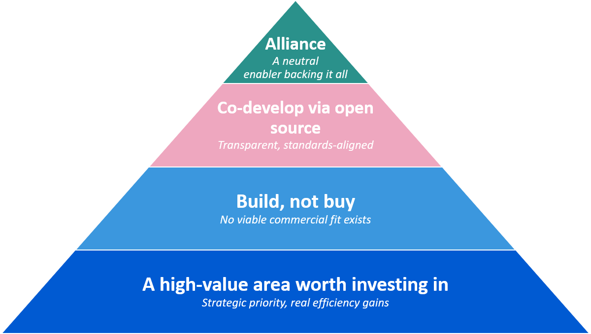
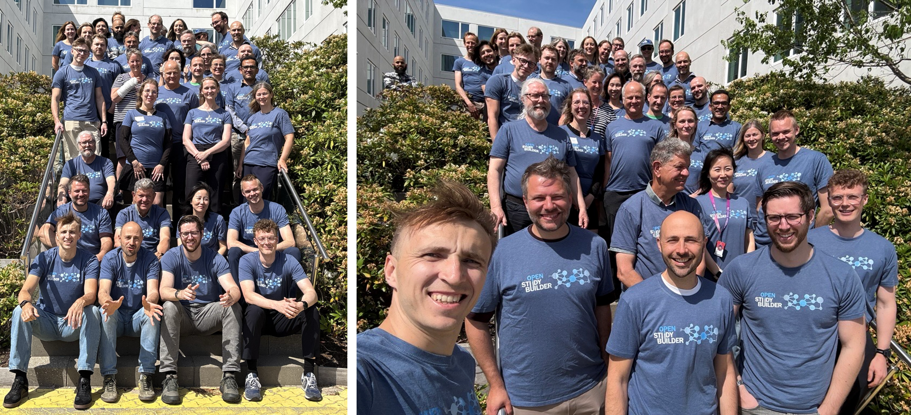

---
hide:
  - toc
---

# Alliance Vision Established - Collaboration Agreement Signed

{: .imageNoBorder}
{: class="imageParagraph"}

Figure 1: The OpenStudyBuilder Alliance Vision Established - Novo Nordisk, Bayer, and Boehringer Ingelheim joining into a collaboration agreement
{: class="imageDescription"}

## A Major Milestone: The OpenStudyBuilder Collaboration

This is a moment we have been working toward for months - and we could not be more excited to share it. The OpenStudyBuilder Alliance vision has been established as a formal collaboration agreement between Novo Nordisk, Bayer, and Boehringer Ingelheim!

For the first time, three pharmaceutical companies are joining forces around OpenStudyBuilder, turning a shared vision into a committed, formal partnership. This marks a defining step in the journey of OpenStudyBuilder - from an open-source solution into a true industry collaboration.

The collaboration aims to accelerate co-development and value from future-proof solutions for digital study design specifications and standards management based on existing and emerging clinical data standards through an industry partnership. OpenStudyBuilder is intended to become the open-source solution for the industry - establishing a single, standardized source of truth for digital study design specifications and unlocking data- and AI-driven operational and scientific excellence across clinical development.

With this, the partners are taking the next step toward driving OpenStudyBuilder as a shared industry solution - enabling open collaboration, a growing ecosystem, and a true end-to-end digital data flow.

## Beyond Open Source: Why an Alliance Vision

Open Source has been at the heart of OpenStudyBuilder for years - but being open source alone is not enough to realize its full potential. To understand why this collaboration is such an important step, it helps to follow the chain of reasoning that led us here: from why this area matters at all, to why it must be built collaboratively, to why a joint partnership is the right vehicle to carry it forward.

{: .imageNoBorder}
{: class="imageParagraph"}

Figure 2: From a high-value area to an alliance - the rationale behind the collaboration
{: class="imageDescription"}

**A high-value area worth investing in.** Digital study design specifications and standards management have become a cornerstone of clinical development strategies. Shifting to metadata-driven workflows drives down cycle times of study setup and conduct through parallelization and unlocks substantial AI and automation opportunities across operational and scientific clinical excellence. The value is tangible - meaningful efficiency gains for impacted roles and solid business cases over a multi-year horizon - while regulatory developments such as ICH M11 continue to accelerate the need for digitalization and data standardization.

---

**Why build, rather than buy.** A natural question is why this cannot simply be solved with a commercial off-the-shelf product. The answer is that MDR/SDR tools require deep domain knowledge that lies well beyond the reach of typical technology providers, and the underlying business models are difficult to sustain commercially. These solutions demand a high degree of customization to support diverse cross-value-chain processes, come with significant adoption barriers. Past vendor-led efforts have too often resulted in rigid, closed platforms requiring heavy customization and leaving users dissatisfied. In other words: a great fit-for-purpose commercial solution is unlikely to ever fully materialize.

---

**Why co-develop via open source.** If building is the right path, open source is the right model. OpenStudyBuilder is an implementation of industry standards, and a successful implementation builds directly on industry alignment. Co-developing in the open minimizes process risk across all actors when implementing standards and preparing for emerging requirements. It supports the broad integration footprint needed to work across vendors, and provides the transparent, open digital foundation that cross-industry standardization requires. Crucially, broad industry adoption is what ensures the generalizability, extensibility, and modularity needed to adapt to changing business & regulatory requirements over time.

---

**Why a joint partnership on top.** And this is where the collaboration comes in. An open-source product thrives on the community and commitment behind it - and a formal collaboration agreement provides exactly that backbone. It reduces reliance on any single company, accelerates roadmap contributions to lower development costs, and improves solution quality by avoiding over-customization. It lowers operational and integration costs through a strong joint voice, accelerates adoption through shared learnings and knowledge exchange, and gives the partners a footprint to help shape the industry. Above all, it establishes a neutral, capable enabler to fuel all these benefits - something open source alone, without organized backing, cannot sustainably provide.

## The Collaboration: From Vision to Agreement

**Finding the right partners.** The journey to this collaboration began with a search. Over the past year, Novo Nordisk set out to find partners willing to engage deeply in the co-development of OpenStudyBuilder - not just to use it, but to help shape and build it further. We presented our vision for a shared, standards-driven industry solution, and found two excellent partners in Bayer and Boehringer Ingelheim. Together, we then specified what we want to achieve, how, and aligned on a common ambition built around three strategic goals:

- Establish OpenStudyBuilder as a true industry solution, through shared engagement and joint responsibility.
- Mature and consolidate OpenStudyBuilder into a market-leading solution, through accelerated development.
- Accelerate the implementation of clinical data standards, for optimized value and adoption across the industry.

**The devil is in the details.** Apart from the ambition, details needed to be worked out, especially aligning with legal requirements. These discussions ultimately led us to implement the partnership as a collaboration agreement with a dedicated governance structure - a pragmatic and sound foundation that lets three companies collaborate effectively while each continues to act independently for itself.

**A phased journey ahead.** With the agreement in place, the path forward is deliberately phased:

1. **Near-term** - get the collaboration up and running with its founding members.
2. **Next step** - broaden the focus toward supporting, involving, and growing the wider community.
3. **Longer-term** - scale by welcoming additional partners, building a clear collaboration model with service and technology providers, and driving broader industry adoption and ecosystem partnerships.

## What Happens Now: Operationalizing the Collaboration

Right now, our immediate focus is on operationalizing the collaboration - turning it into a working, day-to-day reality. In practice, this means concentrating on a few concrete areas:

- Aligning on a shared roadmap
- Establishing the environment and processes for joint co-development
- Setting up a common testing environment
- Enabling knowledge exchange across the partners
- Continuing to enhance our solution documentation

Importantly, all this directly benefits the open-source project as a whole and not just the collaboration partners. The collaboration is a driving force for OpenStudyBuilder, and the value it creates flows back to everyone: new features developed through the partnership are released into the public solution, and the documentation we improve is openly available to all. In other words, as the collaboration accelerates development, the entire community gains more - more capabilities, better documentation, and a stronger, faster-evolving open-source solution.

As this work progresses, there will be plenty to share. As always, we will keep the community informed through this newsletter, our homepage, and at conferences along the way.

## Get Involved

OpenStudyBuilder has always been about open collaboration, and that does not change. A contribution process is already in place, so if you are interested in contributing concretely, we warmly invite you to simply get in touch with us. And for those who want to build on top of OpenStudyBuilder, the platform also supports extensions, allowing anyone to implement their own features as self-contained modules without touching the core solution.

{: .imageNoBorder}
{: class="imageParagraph"}

Figure 3: OpenStudyBuilder Team at the Novo Nordisk Meetup
{: class="imageDescription"}

Beyond the partnership itself, we remain actively engaged in the broader standards community. We continue to be deeply involved in the TransCelerate DDF initiative and in CDISC, where we closely follow and support the 360i project. These connections keep OpenStudyBuilder aligned with where the industry is heading and help ensure that the digital data flow we are building remains open, connected, and interoperable.

!!! info "Get in Touch"
    If you would like to learn more, explore a collaboration, or simply exchange ideas, please reach out to us at <a href="mailto:openstudybuilder@gmail.com">openstudybuilder@gmail.com</a>. Let's continue to shape the future of digital clinical development together.
