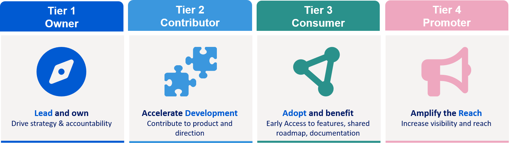

---
hide:
  - toc
---

# The OpenStudyBuilder Tiering Model

OpenStudyBuilder has always been built around the idea of open collaboration. As the community continues to grow and more organizations would like to engage with the project, a clear framework is needed that enables companies to participate according to their ambitions, interests, and available resources.

Rather than creating a one-size-fits-all model, we developed a tiered approach that allows organizations to engage at different levels while sharing the same long-term vision. The model spans four tiers, each reflecting a different level of benefits, involvement, influence, and responsibility. It is designed to evolve step by step, starting with the tiers that can be realized today and expanding as the collaboration matures.

{: .imageNoBorder}
{: class="imageParagraph"}

Figure 1: The four-tier model for engaging with OpenStudyBuilder
{: class="imageDescription"}

**Tier 1 (Owner)** represents the highest level of ownership and leadership. Organizations at this level would carry overall responsibility for the strategic direction and technical development of OpenStudyBuilder, while gaining access to the full value the model offers. Tier 1 requires a dedicated legal entity to formally anchor this alliance ownership. As this entity is not yet in place, Tier 1 is not implemented at this stage and will be established as the collaboration grows.

---

**Tier 2 (Contributor)** is the entry point that is active today, formalized through a collaboration agreement between the partners. It is suited for organizations that want to contribute significantly to product development and help shape the overall roadmap direction, while benefiting from closer knowledge exchange and enhanced license rights. Tier 2 accelerates development through product and financial contributions, strengthening the shared development effort. This is where Boehringer Ingelheim and Bayer joined.

---

**Tier 3 (Consumer)** is designed for organizations that want to build knowledge for product adoption and benefit from early access to new features and the shared roadmap. It offers a low-threshold way to stay close to the development and gain value from the collaboration from day one.

---

**Tier 4 (Promoter)** is for organizations that want to be visibly associated with OpenStudyBuilder and support its recognition across the industry. Through public association, for example being named and featured in the OpenStudyBuilder context, promoters signal their endorsement while helping to raise the profile of the collaboration. This mutual visibility strengthens awareness among potential members and partners and helps the ecosystem grow.

Together, the four tiers provide a clear pathway for organizations to become part of the OpenStudyBuilder journey. Whether contributing to development, shaping strategy, preparing for adoption, or promoting the initiative, every level plays an important role. 

## OSB is open to Everyone 

OpenStudyBuilder is evolving beyond a software project. It is becoming a shared industry initiative where pharmaceutical companies, technology partners, service providers, standards organizations, and the wider open-source community can jointly shape the future of digital study design specifications and standards management together. The tiering model provides the structure that enables this collaboration to grow in a sustainable, transparent, and scalable way.

!!! tip "The tier model is about collaboration - not about access."

OpenStudyBuilder remains an open-source project at its core, and the collaboration model does not change that. Every organization is free to use the software, build extensions, develop integrations, and contribute code regardless of tier membership.

The tier structure simply defines different ways of collaborating:

- **Tier 1** will become available once the corresponding legal entity has been established.
- **Tier 2 and Tier 3** include defined commitments and collaboration principles.
- **Tier 4** simply requires the willingness to be publicly associated with the initiative.

Code contributions are equally possible for non-members through the Contributor License Agreement, with all accepted contributions flowing back into the shared open-source project. Dedicated collaboration models for service providers and technology partners will complement the tier structure and further strengthen the surrounding ecosystem.

Ultimately, the tier model is an invitation rather than a barrier. Whether your organization wants to explore OpenStudyBuilder, contribute to its development, help shape its direction, or simply support the initiative, there is a place within the ecosystem. We invite you to join us in building an open, standards-driven foundation for the future of digital study design.
