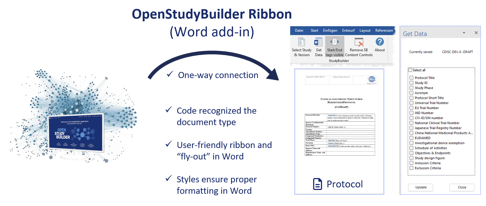

# Word Add-In {: class="guideH1"}

(created 2026-02-18) 
{: class="guideCreated"}

The **OpenStudyBuilder Word Add-In** connects structured study information from OpenStudyBuilder with Microsoft Word protocol templates.

It enables automated population of predefined Word content controls using structured data retrieved via the OpenStudyBuilder API - reducing manual copy-paste, improving consistency, and aligning document output with system-based study definitions.

The Word Add-In creates a ribbon in Word. With this ribbon, Word can connect to the information available in OpenStudyBuilder and initially load or update available data fields into an open Document. For this it is possible to initially load for example the Schedule of Activities into a clinical protocol or update this when for example new visits or activities are added.

## Overview

The Word Add-In is a VSTO-based Microsoft Word extension that:

- Connects to an OpenStudyBuilder instance via API  
- Authenticates via Microsoft Entra ID  
- Allows selection of a study and version  
- Inserts structured study data into prepared Word templates  
- Supports repeated updates if study content changes  

The Add-In is designed to support structured protocol authoring and document automation in environments working with CDISC-aligned study definitions.

## Repository

The source code and technical documentation are available in the official [GitHub](https://github.com/NovoNordisk-OpenSource/openstudybuilder-word-addin){target=_blank} repository. For detailed technical information, installation instructions, and developer setup, refer to:

- [README](https://github.com/NovoNordisk-OpenSource/openstudybuilder-word-addin/blob/main/README.md){target=_blank} - build & deployment instructions
- [Documentation](https://github.com/NovoNordisk-OpenSource/openstudybuilder-word-addin/blob/main/documentation.md){target=_blank} - usage & template configuration details

## Demonstration

The following video demonstration shows the key features and workflow of the OpenStudyBuilder Word Add-In in action:

<iframe
  title="OpenStudyBuilder Word Add-In Demo"
  width=720
  height=400
  src="https://www.youtube.com/embed/IwdrmIDUuyU"
  frameBorder="0"
  allow="accelerometer; encrypted-media; gyroscope; picture-in-picture"
  allowFullScreen
></iframe>
