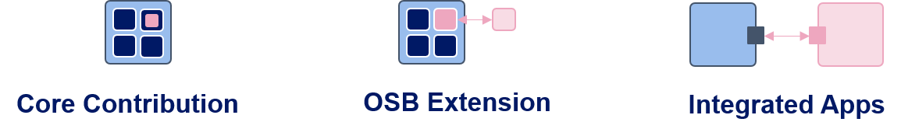
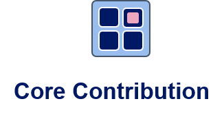
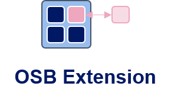
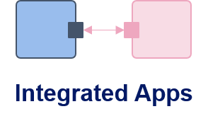

# Contribution {: class="guideH1"}

(updated 2026-06-24) 
{: class="guideCreated"}

As OpenStudyBuilder adoption grows, Novo Nordisk is actively enabling broader participation in its development and maintenance. Extensions and integrations can already be built by anyone. Core contributions to the OpenStudyBuilder codebase are supported via a Contributor License Agreement (CLA) process. A formal [collaboration agreement](./collab_intro.md) between Novo Nordisk, Bayer, and Boehringer Ingelheim is now in place, marking a significant step toward a shared industry-driven development model.

{: .imageNoBorder}

In the scope of OpenStudyBuilder, additional functionality could be implemented in three different ways.

  

    
  

  

     The "Core Contributions" are changes to the core source code of OpenStudyBuilder, led by Novo Nordisk and released as open-source. Core contributions from outside the formal collaboration agreement are supported via a Contributor License Agreement (CLA) process - see <a href="#core-contributions">below</a> for details.
  

  

    
  

  

    Then there is the option to create "OSB Extensions". These extensions look and feel as if they were core functionalities integrated into the User Interface but are actually standalone features that could be developed, maintained, and delivered by anyone. The extension mechanism is now implemented - see the <a href="./../guide_extensions">Extensions Guide</a> for details. Note that licensing is not entirely free, as extensions are compiled into the OSB build - see below for details.
  

  

    
  

  

    Finally, OpenStudyBuilder can integrate with various other applications, such as EDC systems, authoring tools, or any other relevant software. These integrations connect externally via the API and can be developed, maintained, and delivered by anyone using any license. We already see integrations for Oracle and Marvin EDC systems, as well as the Marvin ePRO tool, and we anticipate many more to come.
  

## Extensions and Integrations

**Integrations** connect to OpenStudyBuilder externally via the API and can be released under any license. The consumer API is stable and version controlled, but currently covers only a limited set of endpoints. Most integrations will therefore need to use the internal API - be aware that the internal API can change at any time.

**Extensions** are now implemented and documented in the [Extensions Guide](./guide_extensions.md). Unlike integrations, extensions must be added before compilation and become part of the full OSB build. Since OpenStudyBuilder is licensed under GPLv3, the copyleft obligations of GPLv3 apply to the combined result when distributed. The guide also holds details on licensing implications.

If you have questions, contact us via <a href="mailto:OpenStudyBuilder@gmail.com">OpenStudyBuilder@gmail.com</a>.

## Core Contributions

Core contributions are code changes to the core source code of OpenStudyBuilder, led by Novo Nordisk. Contributing requires a Contributor License Agreement (CLA) - see below for details. Note that the formal collaboration agreement includes its own separate CLA arrangements as part of the partnership terms - the CLA described here applies to contributions outside of that partnership.

### Contributor License Agreement {#cla}

A Contributor License Agreement (CLA) is required for core contributions. The CLA can be requested by contacting us - once received and signed, submit it as described below.

**Instructions**: When you have received and signed the CLA, send the scanned document as mail to <a href="mailto:kjgl@novonordisk.com">kjgl@novonordisk.com</a>.

### CLA Background

When someone is the owner of source code, this entity is enabled to change the license to any other license. Without a CLA, contributions to a repository via GitHub or GitLab for example use the license of the repository. This means that for the copy-left license used in OpenStudyBuilder (GPLv3), contributions are also under the GPLv3 license. To enable the owner to change the license, a CLA is needed. The CLA is a legal document that gives the owner the right to change the license of the contributions among other rights. The CLA is a one-time process and is valid for all contributions to the repository from the entity.

**Why do we need a CLA?**

Argument | Description
--- | ---
Clarify Rights & Ownership | Ensures that the project maintainers have the necessary rights to use, modify, and distribute the contributed code.
Prevent Legal Disputes | Helps avoid future intellectual property conflicts by confirming that contributors have the right to contribute the code and are not violating any third-party rights.
Enable License Compliance | Ensures that all contributions align with the project's open-source license, avoiding potential licensing conflicts.
Protect Against Patent Claims | Some CLAs include clauses that prevent contributors from later asserting patent claims against the project based on their contributions.
Facilitate Business & Community Adoption | Provides assurance to companies and individuals that the project is legally sound, encouraging broader use and contribution.

**Project Harmony Agreements**

The OpenStudyBuilder CLA is based on the [Project Harmony](https://www.harmonyagreements.org/){target=_blank} standard agreements. The following provides a short overview of the two agreement types defined by Project Harmony:

Feature | License Agreement (CLA) | Assignment Agreement (CAA)
--- | --- | ---
Ownership | Contributor **retains copyright**. | Contributor **transfers copyright** to the project maintainer.
Rights Granted | The project gets a **broad license** to use, modify, and distribute the contribution. | The project maintainer becomes the **full owner** of the contribution.
Contributor Control | Contributor retains some rights, such as reusing their code elsewhere. | Contributor loses ownership but may receive a **license back** to use the contribution.
Flexibility | Easier for contributors as they keep ownership. | Gives the project stronger control over contributions.
Legal Complexity | Less complex, as it only grants a license. | More complex, as it requires a formal transfer of copyright.

## Long term vision

The vision of a shared, industry-driven model for maintaining and evolving OpenStudyBuilder is no longer a distant goal - it is being realised. A formal [collaboration agreement](./collab_intro.md) has been signed, establishing a committed partnership for co-development. The longer-term ambition is to continue growing this model - welcoming additional partners and driving broader industry adoption.