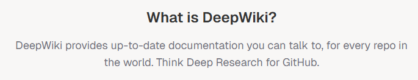
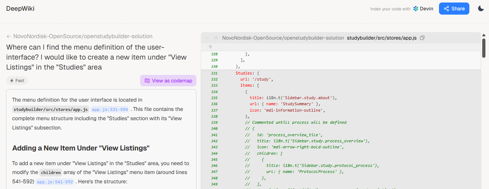

# DeepWiki - Talk to our Source Code {: class="guideH1"}

(status 2025-12-10) 
{: class="guideCreated"}

We are excited to introduce DeepWiki as a new way to explore and understand the OpenStudyBuilder codebase. DeepWiki applies LLM-based reasoning on top of our GitHub repository, allowing users to ask questions as if they were speaking directly with a developer, architect, or data modeller - and receive contextual answers linked to the actual source files.

A special thanks goes to our community members at Boehringer Ingelheim, who set up DeepWiki for the OpenStudyBuilder. This enables everyone to navigate the repository more intuitively and discover insights that might otherwise require deep technical familiarity. You can explore the OpenStudyBuilder DeepWiki instance here: [https://deepwiki.com/NovoNordisk-OpenSource/openstudybuilder-solution](https://deepwiki.com/NovoNordisk-OpenSource/openstudybuilder-solution){target=_blank}. 

While DeepWiki offers an impressive level of contextual guidance, it is important to remember that LLM-generated explanations may not always be fully accurate. A question like "What are the cost elements?" might initially return the answer that OpenStudyBuilder is entirely open-source with no associated cost, which is true for the application itself. With a refined question such as "Consider prerequisites as well", DeepWiki might then correctly identify that running OpenStudyBuilder requires the complementary component Neo4j, which introduce licensing considerations. The quality of results depends strongly on how the question is phrased and can accelerate understanding - as long as the output is treated as guidance rather than ground truth.

DeepWiki also shines for more technical developer questions. For example, asking: "Where can I find the menu definition of the user interface? I want to add a new item under 'View Listings' in the 'Studies' area." returns highly actionable guidance. DeepWiki not only points directly to the relevant configuration files including the corresponding localization entries, but also provides step-by-step instructions on what must be added and where.

For developers and contributors, this turns the OSB codebase into a far more approachable and discoverable environment.