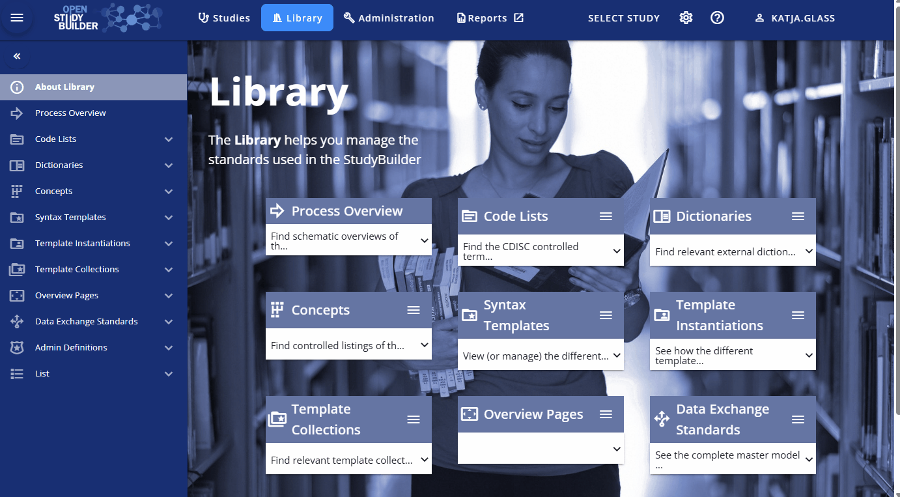

# Maintaining Activities {: class="guideH1"}

(created 2025-05-06 using v0.15)  
{: class="guideCreated"}

This guide provides a step-by-step walkthrough on how to create and maintain activities, including their groupings and instances.

## Create Activity

Activities are the building blocks of a study protocol. They can be created in the library (Library -> Concepts -> Activities) and are used to define the tasks that will be performed during the study. Data specifications for a specific activity can then be defines as an activity instance (see below).

When creating a new activity, the group and subgroup it belongs to must be selected. It must have a name and should also contain the NCI Concept ID if available. The NCI Concept ID is a unique identifier for the activity and is used to link it to the NCI Thesaurus, which provides standardized terminology for clinical research. To be able to use a created activity, the activity needs to be approved.

## Create Activity Group

Activities can be organized into two levels of groupings: "Activity Group" and "Activity Subgroup". These groupings are used in the Schedule of Activities (SoA), where study activities are assigned. On the protocol display, you can define which headings—groups, subgroups, and/or activity names are shown.

To create a new Activity Grouping, navigate to the library (Library -> Concepts -> Activities) and open the "Activity Groups" tab. Here, you can browse existing groupings, edit or approve them, or create a new one by clicking the "+" button. 

Once a new group is created, it must be approved before it can be used. To approve the group, search for it in the table, click the three dots next to it, and select "Approve".

## Create Activity Subgroup

Subgroups can be created in a similar way to groups but are managed in the **Activity Subgroups** tab. When creating a new subgroup, you must select the group it belongs to. The subgroup will then be created within the context of the selected group.

## Create Activity Instance

Coming soon!