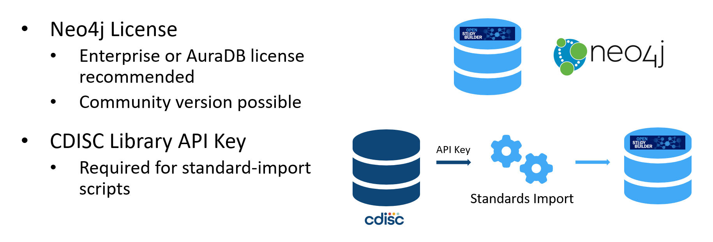
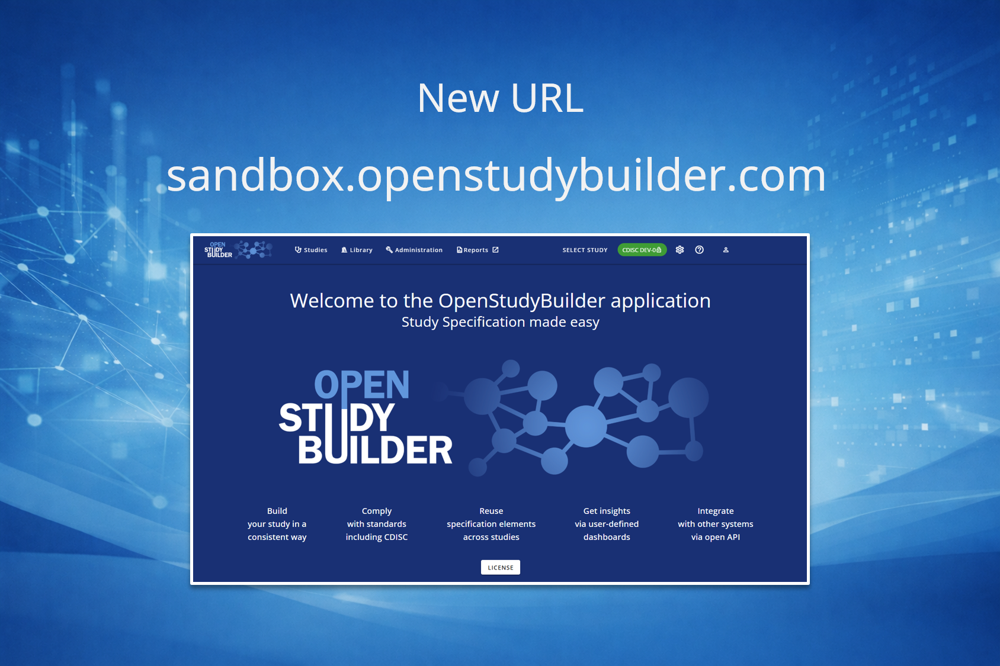

# Environments {: class="guideH1"}

(updated 2026-06-23) 
{: class="guideCreated"}

## Pre-Requisites

To run the OpenStudyBuilder, you will need the following pre-requisites:

The current implementation required **CDISC library access** via a library API key to access CDISC standards (freely available also for non-CDISC-members). This is used to receive CDISC standards and processed in the MDR-Standards-Import scripts which load for example new CDISC Controlled Terminology into the OpenStudyBuilder.

As OpenStudyBuilder is using a Neo4j graph database, a **Neo4j database license** is required. We highly recommend using the enterprise or AuraDB license which comes along with services and features recommended. It is also possible to use the GPLv3 licensed community edition which is available at no cost. OpenStudyBuilder can also run on the community edition, but some features like consistency checks are not be available. The migration scripts we provide to update the database schema from an old to a new version will also not be running and would need manual updatings.

## Deployment Options

The OpenStudyBuilder is a modular solution consisting of several components, including a Neo4j database, a web application, and an API and more. The system can be deployed in various ways, depending on your needs and preferences. Access to the open-source code is available via [GitHub](https://github.com/NovoNordisk-OpenSource/openstudybuilder-solution){target=_blank}. The repository contains [installation instructions](https://github.com/NovoNordisk-OpenSource/openstudybuilder-solution/blob/main/README.md){target=_blank} using docker. Furthermore, each component has its own readme file with installation instructions and can be installed independently.

We have an [OpenStudyBuilder accelerators repository](https://github.com/NovoNordisk-OpenSource/openstudybuilder-accelerators){target=_blank} where other deployment options are available. There is a simple deployment available via existing pre-compiled images. Furthermore, a complex HELM chart is available with different configurations to serve complex business needs.

Option | Description
--|--
Local Desktop | The OpenStudyBuilder can be run on a local desktop environment
Server Installation | OpenStudyBuilder can be setup to run on a server
Cloud | The OpenStudyBuilder can be deployed on all major cloud platforms
Hosted Cloud Environment | The OpenStudyBuilder can be hosted by a vendor
Sandbox | A public sandbox environment is available for evaluation purposes

## Neo4j Licenses and Setup

The OpenStudyBuilder docker setup is using the Neo4j Enterprise version. This can be used for evaluation and test purposes. To use OpenStudyBuilder in production, either purchase an Enterprise version or switch to the [community edition](./info_osb_hub.md#neo4j-community-edition).

Neo4j offers a number of commercial licensing options, including free licenses for development, startups, academic-educational uses and of course, evaluation.

OpenStudyBuilder can run differently with Neo4j. It can use the Enterprise version or the AuraDB clould database service. For AuraDB the following options are available:

1. Neo4j AuraDB database + OpenStudyBuilder App and API
2. Neo4j AuraDB database + OpenStudyBuilder API (build your frontend)
3. Neo4j AuraDB database only (for exploration purposes)

To learn more, visit the [AuraDB website here](https://neo4j.com/cloud/platform/aura-graph-database/), or see contact details below.

For more information about the licenses and deployment options, please use the following contact information:

- Jan Aertsen - Professional Services EMEA
- +32(485)329828 & +39(339)8702150
- <a href="mailto:openstudybuilder@neotechnology.com">openstudybuilder@neotechnology.com</a>

## HTP42 Evaluation Environments

To evaluate the OpenStudyBuilder, HealthTechPartners42 provides a free hosted sandbox environment. They also offer additional evaluation environments.

Type | Access | Complete initial dataset | Custom data | Usable for production | Pricing
--|--|--|--|--|--
Sandbox | Public | No | No - creating elements is possible, but this environment will be refreshed periodically | No | Free
Dedicated | Restricted | Yes | Yes | Optionally | See contact details below

For more information, please reach out to HTP42: <a href="mailto:openstudybuilder@htp42.com">openstudybuilder@htp42.com</a>.

## Public Sandbox Access

The public sandbox provides a convenient way for anyone to explore and test OpenStudyBuilder without the need to install any software. To request access to the sandbox environment, simply send an email to <a href="mailto:openstudybuilder@htp42.com?subject=Request%20Sandbox%20Access">openstudybuilder@htp42.com (Request Sandbox Access)</a>. 

The solution can then be accessed via the following link: [sandbox.openstudybuilder.com](https://sandbox.openstudybuilder.com/){target=_blank}.

Please be aware that the sandbox is refreshed periodically, which means any data you create will be lost after a refresh. Additionally, all data in the sandbox is publicly accessible to anyone with sandbox access. For transparency and traceability, all data entries are tracked with the user's email address and are visible to everyone using the sandbox. Therefore, please avoid entering any sensitive or confidential information. The sandbox is intended for evaluation and learning purposes only. 

## Sandbox Migration - 2026-03-01

As focus areas and operational priorities evolve, the decision was made to transition the hosting of the Public Sandbox to a partner with a stronger emphasis on operationalization and managed solution hosting. We are therefore pleased to announce that HealthTechPartners42 took over the hosting of the Public Sandbox which went live on 1st March 2026. With experience in Neo4j and infrastructure hosting as well as standards governance strategies and digital data flow setup, they bring the expertise required to ensure continued operation and sustainable maintenance of the environment. 

The old sandbox instance is decomissioned.