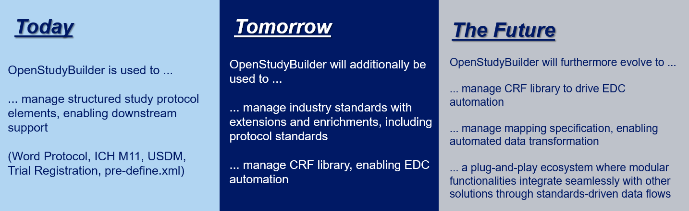

# Open Source Strategy and Rationale

**OpenStudyBuilder** is a next-generation solution for end-to-end clinical data standards and study specifications. It enables study data tools to access structured metadata that reduces manual, document-driven processes and supports automation through a Digital Data Flow approach.

??? tip "Description"
    Already **today**, OpenStudyBuilder is used to manage structured study protocol elements, enabling downstream support for Word Protocol, ICH M11, USDM, Trial Registration and creating a pre-define.xml.

    Expecting to come in **2025**, is the management of industry standards with extensions and enrichments, including protocol standards, as well as the management of a CRF library to enable EDC automation.

    In **long term**, OpenStudyBuilder will evolve to manage a CRF library to fully drive EDC automation, manage mapping specifications to enable automated data transformation, and become a plug-and-play ecosystem where modular functionalities integrate seamlessly with other solutions through standards-driven data flows.

The OpenStudyBuilder implements the digital data flow as envisioned by the TransCelerate [DDF](https://www.transceleratebiopharmainc.com/initiatives/digital-data-flow/){target=_blank} initiative. Furthermore, we are a core part of showcasing standards end-to-end implementations in the CDISC [360i](https://www.cdisc.org/cdisc-360i){target=_blank} initiative.

Guided by this vision, we made the strategic decision to open source OpenStudyBuilder - laying the foundation for a shared, standards-driven solution that invites collaboration and accelerates transformation across the industry.

## Why Open Source?

Novo Nordisk has decided to open source the OpenStudyBuilder solution to enable the industry to benefit from a shared metadata and study definition foundation to accelerate trial design, conduct and submission by increasing consistency, improving efficiency, and driving automation.

The strategy is rooted in the belief that digital transformation in clinical development requires collaboration, transparency, and reusable tools. By sharing OpenStudyBuilder as open source, we aim to foster community contributions, reduce redundant proprietary development, and collectively move towards an interoperable, standards-driven ecosystem.

This decision was shaped by several key motivations:

- **Implementing the End-to-End Vision**: Inspired by the potential of CDISC 360 and Digital Data Flow (DDF), we saw the need for a solution that operationalizes their vision - enabling fully connected, machine-readable, and standards-driven study definitions. Open source provides the transparency and collaboration needed to turn this vision into reality.

- **Limited Existing Solutions**: We observed a lack of tools that support the CDISC 360 and DDF visions or offer the critical functionality. By open sourcing OpenStudyBuilder, we enable the broader community to close this gap together.

- **Avoiding Legacy Pitfalls**: Rather than building yet another proprietary, monolithic system, we designed OpenStudyBuilder to be modular, standards-based, and integration-friendly. Open source ensures it remains adaptable and free from vendor lock-in.

- **Reducing Integration Overhead**: System integration is a major pain point across clinical development. With open APIs, shared data models, and an open-source architecture, OpenStudyBuilder reduces the need for custom integration work and simplifies connectivity across tools.

- **Leveraging Community Insight**: By opening the solution, we gain valuable input from experts outside our organization - helping us stay aligned with current best practices, emerging standards, and evolving user needs. This ensures we avoid isolated development and keep the solution modern, relevant, and future-proof.

- **Balancing Investment and Risk**: Open source allows the cost and responsibility of building and maintaining such a solution to be shared. It reduces duplication of effort and spreads the risk across organizations with common goals.

OpenStudyBuilder has the potential to become a **preferred industry solution** - enabling a modular, interoperable ecosystem where connected solutions exchange data seamlessly, supporting a fully digital workflow without the need for manual handovers or document-driven processes.
