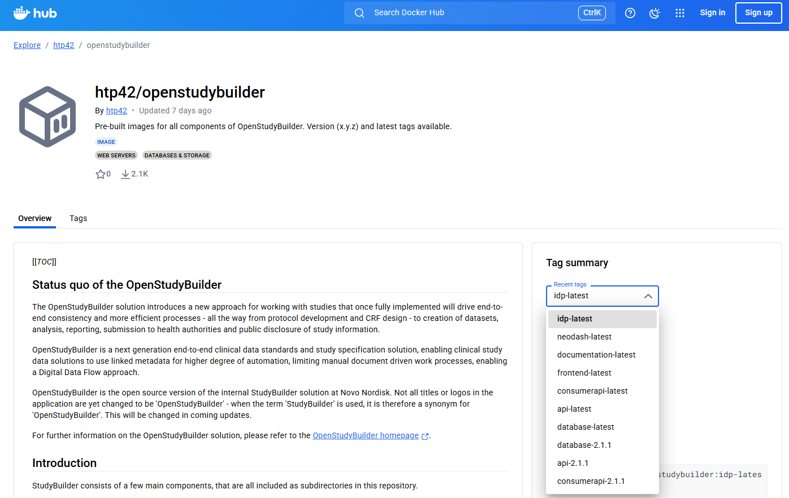
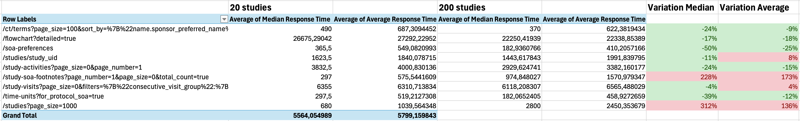

# Community  {: class="guideH1"}

(status 2025-12-10) 
{: class="guideCreated"}

## OpenStudyBuilder Hub (OSB-Hub)

The OpenStudyBuilder Hub (OSB-Hub) is a collaboration team under the umbrella of the [CDISC Open Source Alliance](https://cosa.cdisc.org/){target=_blank} (COSA). Our mission is to support the utilization and enhancement of the OpenStudyBuilder open-source tool. Here, we not only collect valuable feedback and use-cases but also actively run focused projects. Join us to drive innovation forward through both community engagement and project execution.

- Join us on Slack: [Invite](https://join.slack.com/t/osb-mdr/shared_invite/zt-2iwjqjg76-r0NW6pRH5GnGQQ~~izLc_A){target=_blank}
- Feedback on Use-Cases: [Discussions](https://github.com/cdisc-org/osb-hub/discussions/categories/use-cases){target=_blank}
- Checkout information: [Wiki](https://github.com/cdisc-org/osb-hub/wiki){target=_blank}

{: .imageNoBorder}

### Use-Case definitions

We've curated a list of [use-cases](https://github.com/cdisc-org/osb-hub/wiki/UseCases){target=_blank} awaiting your input in [discussions](https://github.com/cdisc-org/osb-hub/discussions/categories/use-cases){target=_blank} to set priorities and expand this list. Your votes help prioritize our work at OSB-Hub, guiding our efforts towards addressing the most critical needs. The results will feed into the OpenStudyBuilder project. Feel empowered to contribute additional use-cases and enrich existing ones with specific requirements. Engage in discussions to shape the future of OpenStudyBuilder according to community insights. Together, we'll chart the course for our upcoming trails.

### OpenStudyBuilder Hub Trails (OSB-Hub-Trails)

We organize focused projects, known as OpenStudyBuilder Hub Trails, where we collaborate to develop documentation and best practices for applying specific use cases in real-life scenarios. These efforts may include creating supporting tools, such as those for import processes, and specifying additional requirements and concepts for potential integration into OpenStudyBuilder.

### OSB-Trail-ControlledTerminology

Kick-off July 2024

Our first OpenStudyBuilder trail focuses on the management of controlled terminology (CT), encompassing CDISC and sponsor standards. Delve into critical questions such as how to seamlessly integrate with new CDISC CT versions? How to load or create sponsor terminology? What kind of additional attributes can I apply? What would I need additionally? How to use this downstream? How to deal with different versions? 

Join the corresponding channel in [Slack](https://join.slack.com/t/osb-mdr/shared_invite/zt-2iwjqjg76-r0NW6pRH5GnGQQ~~izLc_A){target=_blank}!

**Status December 2025** 

The group had been waiting for the re-engineered controlled terminology (CT) model to be available in OpenStudyBuilder. As this is not available, this trail is restarted in January 2026. A community member focus on the development of a user interface to manage import and export of controlled terminologies. 

A first outcome of the first phase of this trail was to feedback on the available CT scripts and showing gaps in functionality which had been considered for the re-engineering. 

### OSB-Trail-SystemEngineers

Kick-off January 2025

Our second OpenStudyBuilder trail focuses on the collaboration of system engineers working with OpenStudyBuilder (OSB). This group aims to unite professionals to share experiences, collaborate on deployment and installation strategies, exchange best practices for monitoring and DevOps, and explore integration opportunities with OSB.

Join the corresponding channel in [Slack](https://join.slack.com/t/osb-mdr/shared_invite/zt-2iwjqjg76-r0NW6pRH5GnGQQ~~izLc_A){target=_blank}!

**Our objectives:**

- Share knowledge on deploying and scaling OSB effectively.
- Discuss best practices for monitoring and DevOps tailored to OSB.
- Exchange experiences and solutions for integrating OSB with other systems.
- Build a network of experts to support and innovate within the OSB ecosystem.

**Status December 2025**

There had been multiple sessions held in 2025:

- 20 January 2025: Kick-Off meeting to discuss focus areas and plan next steps.
- 24 February 2025: Discuss Deployments ([slides](./presentations/2025-02-24-osb-hub-trail-deployments.pdf){target=_blank}, [outcome](./presentations/2025-02-24-DeploymentWorkflows.pdf){target=_blank})
- 24 March 2025: APIs session ([slides](./presentations/2025-03-24-osb-hub-trail-systemEngineering-API.pdf){target=_blank}, [outcome](./presentations/2025-03-24-osb-hub-trail-systemengineers-summary.pdf){target=_blank})
- 28 April 2025: Testing, Loading and Migration ([slides](./presentations/2025-04-28-osb-hub-trail-SystemEngineering.pdf){target=_blank}, [outcome](./presentations/2025-04-28-osb-hub-trail-SystemEngineering-summary.pdf){target=_blank})
- 2 June 2025: USDM Importer and Testing Strategies ([slides](./presentations/2025-06-02-osb-hub-trail-SystemEngineering.pdf){target=_blank}, Recordings: [Introduction](https://youtu.be/nSxa4gUCXeA){target=_blank}, [USDM Importer](https://youtu.be/eJ4C1ZFtK-8){target=_blank}, [Testing Strategies](https://youtu.be/LSGBAjjuFHE){target=_blank})

## Community Projects

There are single community members providing additional guidance and support.

### Neo4j Community Edition

The current default setup is using the Neo4j enterprise version which requires a license. It is recommended to use the enterprise version for productive environments. When you want to test or run the OpenStudyBuilder in a very small scale - you would be able to use the community version. Currently only the data migration scripts will not be working which could be overcome by using a different data migration strategy. You also have to be aware that consisency checks are not available in the community version among other features. Nevertheless, working with the community version is possible and expecting that you validate your output, e.g. in downstraem systems, there is no issue with using the community version.

To switch to the community edition, a few updates are required in the docker-compose file and some other files. Marius Conjeaud has provided a fork of the OpenStudyBuilder repository with the required changes. You can access the fork [here](https://gitlab.com/mariusconjeaud/OpenStudyBuilder-Solution-ce){target=_blank}.

### OpenStudyBuilder Docker Images

The OpenStudyBuilder docker setup for now always required building the images locally. Marius Conjeaud has provided public docker images for the OpenStudyBuilder components which can be used instead of building them. You can find the images on Docker Hub [here](https://hub.docker.com/r/htp42/openstudybuilder){target=_blank}. Thanks to Marius and HTP42 for providing these images to the community.

### OpenStudyBuilder Load Tests

Marius Conjeaud has also provided a load test setup for the OpenStudyBuilder. Performance is a critical aspect. There had been tests setup in GitHub [here](https://github.com/mariusconjeaud/openstudybuilder-load-test){target=_blank}. These tests had been looking very promising, there is not much different on whether there are 20 or 200 studies on the database.

Of course the environment has to be considered. When working in a cloud when the data has to be transferred over the internet, the performance will be different. These tests had been performed on a local machine.

### OSB-USDM-uploader (PoC)

A proof of concept for importing USDM into OpenStudyBuilder has been developed by Phoebe. This solution consists of a Python script and i available as open-source solution in [GitHub](https://github.com/HTP42-OpenStudyBuilder/OSB-usdm-uploader){target=_blank}. The current status and issues has been presented in one of our OSB Hub sessions for system engineers. You can checkout the recording below.

<iframe
  title="USDM Importer (PoC)"
  width=720
  height=405
  src="https://www.youtube-nocookie.com/embed/eJ4C1ZFtK-8"
  frameBorder="0"
  allow="accelerometer; encrypted-media; gyroscope; picture-in-picture"
  allowFullScreen
></iframe>

### USDM-OSB-uploader (PoC)

A second USDM Importer has been developed by Hosbect Chekresh. This solution is a command line python tool and available in GitHub [here](https://github.com/AI-LENS/usdm-osb-uploader){target=_blank}.