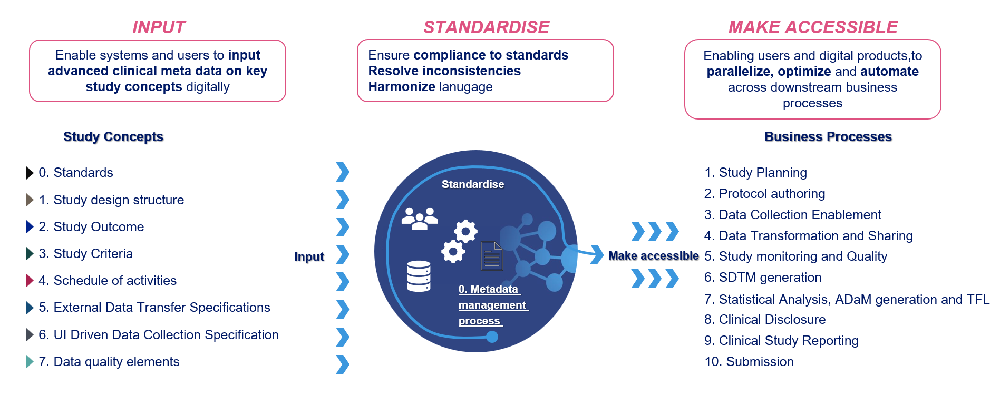
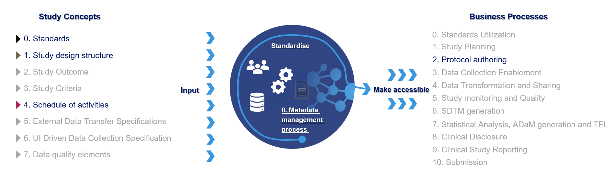
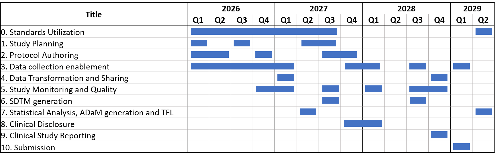
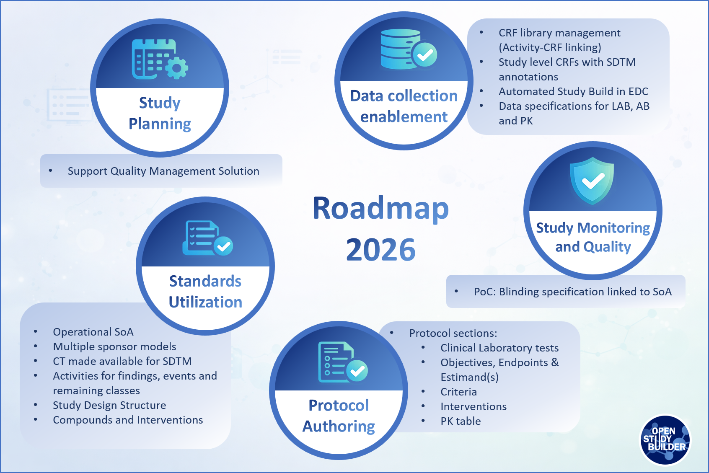
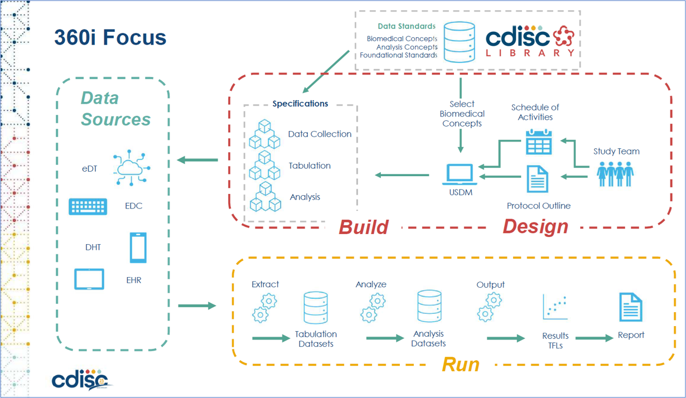

# Scope & Direction of the Project {: class="guideH1"}

(updated 2026-01-26) 
{: class="guideCreated"}

## Our Road Ahead - The Vision

The OpenStudyBuilder is designed to enable true end-to-end automation across clinical trial processes. But what does that really mean in practice?

To bring this vision into focus, we've developed a value framework for OpenStudyBuilder - clarifying its role, guiding our planning, and laying the groundwork for a solid roadmap. Though grounded in Novo Nordisk's specific needs, the framework reflects common challenges and opportunities that are shared across the broader pharmaceutical industry.

{: class="imageParagraph"}

Figure 1: Vision of inputs and business processes which aims to be supported by OpenStudyBuilder
{: class="imageDescription"}

At the heart of this vision are the structured inputs that users and systems provide digitally. Among these, standards are the most critical - they form the foundation for every other input and transformation. This includes global data standards like CDISC, sponsor-specific standards, Biomedical Concepts, CRF libraries, and more.

Once provided, these inputs are processed within the OpenStudyBuilder. The tool serves as a harmonization layer, aligning language, applying standards, resolving inconsistencies, and preparing structured outputs for downstream use.

The real value emerges when the same structured information - like a digitally defined protocol - can seamlessly feed into multiple business processes. This allows both users and systems to access consistent metadata, enabling parallelization, automation, and optimization across the entire clinical trial lifecycle.

The business processes supported by this vision span the full trial road - from study planning and protocol authoring, through data collection enablement, data transformation, SDTM generation, and statistical analysis (ADaM/TFLs), to clinical trial discloser, study reporting and regulatory submission.

As all of these processes depend on standards, a crucial element on the consumption side is standards utilization. This is what enables interoperability between tools and ensures consistency throughout the trial setup and execution.

## Key Achievements at Novo Nordisk in 2025

Several milestones made 2025 a transformational year for OpenStudyBuilder in Novo Nordisk:

- OpenStudyBuilder is recognized as one of the prioritized digital products across R&amp;D.
- The first code contribution from an external pharmaceutical company (many thanks to Boehringer Ingelheim) was successfully accomplished, demonstrating the strong and growing industry interest in OpenStudyBuilder as an open-source solution.
- Schedules of Activities are now specified for all kind of studies in OpenStudyBuilder.
- CRF standards, including SDTM annotations, are available within OpenStudyBuilder.
- Working prototype to synchronize OpenStudyBuilder and EDC utilizing the available EDC API.
- A laboratory metadata report based on OSB metadata has been introduced to support the creation of laboratory data specifications.
- We added USDM and M11 pages, now available for every study. This enhancement positions OpenStudyBuilder to support emerging industry standards and future regulatory requirements. 
- Support for complexity score calculation has been implemented.
- Multiple system enhancements driven by end-user feedback were delivered.
- The internal name was changed from "StudyBuilder" to "OpenStudyBuilder" to emphasize the open-source nature of the solution and its growing industry relevance.
- The system performance has been improved significantly.
- OpenStudyBuilder continues to grow, with close to 300 registered users at Novo Nordisk.

## Where Do We Stand Now

OpenStudyBuilder is already delivering tangible value in the area of protocol authoring. At Novo Nordisk, it is used in production to define structured protocol elements - most notably the Schedule of Activities (SoA) - and automatically populate them into the corresponding Word-based protocol template for all studies.

Looking back at 2025, OpenStudyBuilder has significantly matured structured protocol content management. We established and expanded core capabilities around Schedules of Activities. Furthermore, we successfully prepared and loaded CRF standards into the solution. These foundations lay the groundwork for the next major milestone on our journey: EDC automation.

We have also seen that the contribution model is working. But to truly enable broad industry adoption and sustainable collaboration, we must go further. Important work is already in progress and there will be much more to share throughout 2026. We strongly believe that 2026 will become the year of industry adoption for OpenStudyBuilder.

{: class="imageParagraph"}

Figure 2: Current live business processes
{: class="imageDescription"}

Our solution is prepared to support additional business processes beyond protocol authoring. We are expecting the Standards Utilization and Data Collection Enablement be go into production in 2026.

## Where to Go Next

We will continue to enhance the management and maintenance of related standards across OpenStudyBuilder. This includes controlled terminology, CRF standards, biomedical concepts expressed as activities, sponsor-specific SDTM and ADaM data models, protocol-related standards such as structured and standardized criteria and more. In parallel, we will further strengthen capabilities supporting study planning and early study design.

A major focus for 2026 will be the enablement of data collection - specifically advancing EDC automation. Throughout 2025, we refined CRF standards management, and at Novo Nordisk all CRF standards are now loaded into OpenStudyBuilder. Building on this foundation, 2026 is expected to bring an implemented specific EDC integration. It is important to note that Oracle ClinicalOne is already integrated in production, and additional EDC systems supporting the ODM standard are also supported.

Another important shift in 2026 will be an additional focus on protocol authoring support, an area that had not previously been prioritized. In addition, we plan to start addressing selected study monitoring processes toward the end of the year.
 

{: class="imageParagraph"}

Figure 3: Current OpenStudyBuilder Roadmap by Business Process
{: class="imageDescription"}

Looking further ahead, a high-level roadmap for 2027 and beyond has been defined. This is based on a value framework which investigated which downstream processes could and should be supported by OpenStudyBuilder, considering prerequisites and existing workflows. The future focus areas include support for SDTM, ADaM, and TLF generation, as well as processes around clinical disclosure, study reporting, and submission.

Naturally, the further we look into the future, the more likely shifts will occur. At the same time, it is important to note that some later processes can already benefit from today's OpenStudyBuilder capabilities. For example, ADaM-relevant inputs such as visit structures, endpoints, and activity flows are already available within OpenStudyBuilder and can be leveraged. Furthermore, as industry standards continue to evolve, working with analysis results metadata and even analysis concepts may increasingly come into play and shape future directions.

## Next Steps for 2026

Many community members have expressed interest in more detailed insights into what is planned next. The roadmap below highlights selected focus areas and concrete directions aligned with the targeted business processes. In parallel, we will continue to deliver technical and general improvements across the solution. A major cross-cutting focus for 2026 is performance, which will be systematically analysed and optimized in OpenStudyBuilder.
 

{: class="imageParagraph"}

Figure 4: OpenStudyBuilder Roadmap for 2026
{: class="imageDescription"}

Standards utilization continues to define the base rules for OpenStudyBuilder. Much is already in place, and a significant additional amount of work is planned for 2026. We will further enhance the Schedule of Activities to better support data specifications, strengthen activity linkages and data provision, and connecting controlled terminology.

Planned work includes investigating support for multiple sponsor data models, making controlled terminology directly available for SDTM generation, and extending activity definitions across findings, interventions, events, and remaining classes. We also plan to enhance the study design structure, further develop compounds and interventions.

The existing study planning features will be extended with new export and integration capabilities to support a quality management solution. This will begin with a minimal information set and will be expanded over time to include additional planning-relevant data, enabling broader downstream usage.

Another important focus for 2026 is protocol authoring. We plan to enable OpenStudyBuilder to provide structured content for several protocol sections, including:

- Clinical Laboratory Tests (Appendix 2)
- Objectives
- Endpoints and Estimand(s)
- Criteria
- Interventions

In addition, we plan to support the export of pharmacokinetic tables for protocol inclusion.

We plan to improve the USDM, with much more information directly coming from the metadata defined in the OpenStudyBuilder. At the same time, the ICH M11 Template will be updated to the latest Final version, the [ICH CeSHarP M11 template from 19 November 2025](https://database.ich.org/sites/default/files/ICH_Step4_M11_Final_Template_2025_1119.pdf){target=_blank}.

Data collection enablement remains a central pillar, with a strong focus on automated study build in EDC systems. Planned work includes further strengthening the linkage between activity instances and CRF items, enhancing CRF library management, and supporting the creation of study-specific CRFs including annotations.

We expand data specification support, including dedicated specifications for laboratory data, antibodies, and pharmacokinetics, further strengthening the bridge from protocol content to operational data collection.

Towards the end of the year, we are looking into a proof of concept on how to include blinding information into OpenStudyBuilder linked in a Schedule of Activities.

## The Role of CDISC 360i

The [CDISC 360i](https://www.cdisc.org/cdisc-360i){target=_blank} project will play a central role in demonstrating how the end-to-end flow can function by showcasing the integration of tools and the complete data flow, all driven by industry standards for data and exchange. It brings together experts and tool developers to execute and evaluate the flow and drive improvements, aiming to implement the full process from study planning, through data collection, to SDTM and ADaM generation and beyond, leveraging tools and practices. OpenStudyBuilder will be one of the key solutions to support and showcase this collaborative, end-to-end automation.
 

{: class="imageParagraph"}

Figure 4: CDISC 360i Project Focus
{: class="imageDescription"}

Through CDISC 360i, we will explore how data and metadata can seamlessly flow across different solutions to support various use cases. The project is being developed in parallel across multiple workstreams. A key stream, the "run" phase, focuses on the full data lifecycle - from collection to SDTM and ADaM mapping, through to the final ARD and TFL generation.

In addition, for the "design" phase - where protocol information is collected, managed, and provided - multiple solutions will be integrated. With data flowing smoothly from one system to another, driven by structured protocols, there is significant potential for further process improvements beyond what we currently envision for OpenStudyBuilder. With well-defined transfer standards, integrating and exchanging applications could become as simple as selecting tools from a digital marketplace.

The CDISC 360i project is still in its early stages, but its potential to drive industry-wide harmonization is immense. By not only aligning data standards but also improving the tools and integrations used throughout the clinical trial process, it promises to reshape the way we approach clinical trials. The project's success will have a significant impact on how OpenStudyBuilder is utilized, enhancing business processes and enabling more seamless, automated workflows across the entire clinical trial lifecycle.
