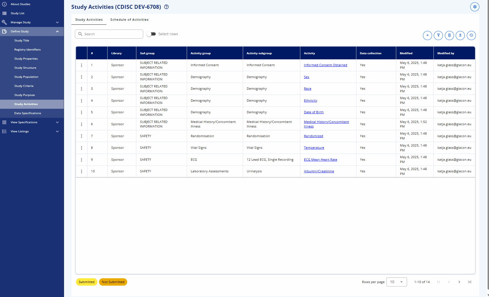
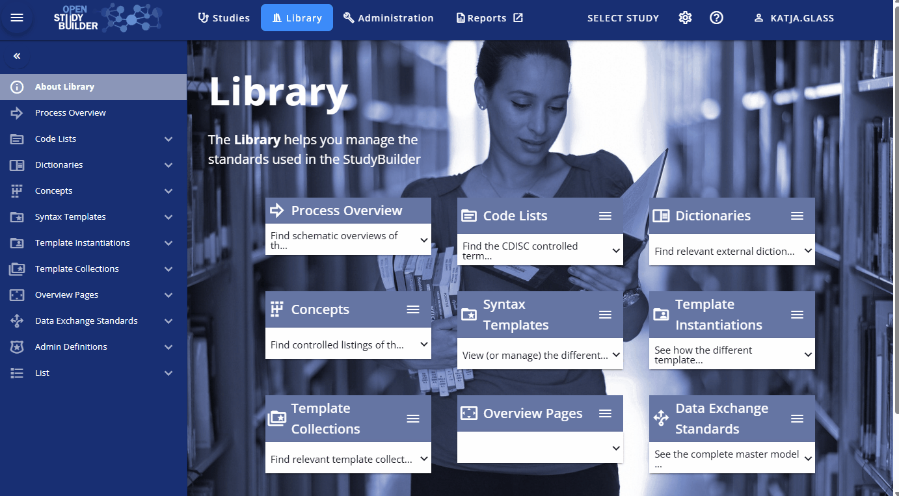

# Workshop Exercises - Design and Build with OpenStudyBuilder

The following instructions are available for the "COSA OpenStudyBuilder Workshop: CDISC 360i - Design and Build with OpenStudyBuilder". Please follow the instructions.

The CDISC Pilot study can be used as a reference for the exercises. We updated the SoA to reflect activity names which are available in OpenStudyBuilder and reduce the number of visits. The pilot study protocol is available [here](https://github.com/cdisc-org/DDF-RA/raw/v3.12.0/Documents/Examples/CDISC_Pilot/CDISC_Pilot_Study.pdf){target=_blank} and the USDM 3.12 representation [here](https://github.com/cdisc-org/DDF-RA/raw/v3.12.0/Documents/Examples/CDISC_Pilot/CDISC_Pilot_Study.xlsx){target=_blank}.

**Focus Area**

Clinical Study Protocol information should be entered into the OpenStudyBuilder - focusing on the Schedule of Activities. This should be made available to enable downstream utilization including data specification definitions.

## Prerequisites

- Sandbox account (requested via mail: <a href="mailto:openstudybuilder@neotechnology.com?subject=Request%20Sandbox%20Access">
openstudybuilder@neotechnology.com - Request Sandbox Access</a>)
- Note, mail address might be exposed due to audit-trail
- Access and log into the sandbox environment ([https://openstudybuilder.northeurope.cloudapp.azure.com/](https://openstudybuilder.northeurope.cloudapp.azure.com/){target=_blank})

## Exercise 1: Create a Study

- Create a new study for project "CDISC Dev" named 80XX (where XX is a random number)

??? tip "Video demonstration"
    

## Exercise 2: Create a Study Epochs

- Create Study Epochs (Studies -> Define Study -> Study Structure -> Study Epochs)
- Use the following information:

<table border="1">
    <thead>
        <tr style="text-align: center;">
            <th>Type</th>
            <th colspan="2">Pre Treatment</th>
            <th colspan="5">Treatment</th>
            <th>Post Treatment</th>
        </tr>
        <tr style="text-align: center;">
            <th>Epoch</th>
            <th colspan="2">Screen</th>
            <th>Treatment 1</th>
            <th colspan="3">Treatment 2</th>
            <th>Treatment 3</th>
            <th>Follow-up</th>
        </tr>
    </thead>
    <tbody>
        <tr>
            <td>Visit (V)</td>
            <td>V1</td>
            <td>V2</td>
            <td>V3</td>
            <td>V4</td>
            <td>V5</td>
            <td>V6</td>
            <td>V7</td>
            <td>V8</td>
        </tr>
        <tr>
            <td>Timing of Visit (Weeks)</td>
            <td>-2</td>
            <td>-0.3</td>
            <td>0</td>
            <td>4</td>
            <td>8</td>
            <td>20</td>
            <td>24</td>
            <td>26</td>
        </tr>
        <tr>
            <td>Visit Window (Days)</td>
            <td>0/+7</td>
            <td>-1/0</td>
            <td>&#x00B1;7</td>
            <td>&#x00B1;7</td>
            <td>&#x00B1;7</td>
            <td>&#x00B1;7</td>
            <td>&#x00B1;7</td>
            <td>&#x00B1;7</td>
        </tr>
    </tbody>
</table>

??? tip "Tip"
    - You might want to select the following epochs
    - Pre Treatment -> Screening
    - Treatment -> Treatment
    - Treatment -> Treatment
    - Treatment -> Treatment
    - Post Treatment -> Follow-up

??? tip "Video demonstration"
    

## Exercise 3: Create a Study Visits

- Create Study Visits (Studies -> Define Study -> Study Structure -> Study Visits)
- Checkout the exercise 2 and use the same information as above
- It's recommended to create first the "week 0" visit to have the "anchor" for all other visits which are relative to this one.
- Additional details about visits are available in the system documentation [here](https://openstudybuilder.northeurope.cloudapp.azure.com/doc/guides/userguide/studies/guide_visits.html){target=_blank}.
- Create at least three visits

??? tip "Tip"
    - We are using "Scheduled visit" for all visits
    - Use the epoch "Treatment 1"
    - Select "Start of treatment" with "On Site Visit" and activate the "Anchor visit". Change the unit to "week". Save that visit.
    - Create the second "Scheduled visit" for "Screening".  It's a "Screening", "On Site Visit". The time is referring the "Anchor visit in visit group", using the "week" time unit starting at -2 (Timing). The window should be from 0 to 7. Save this.
    - The next "Scheduled visit" is also for "Screening". In this case the time reference unit is days and timing "-1". Window is from -1 to 0.
    - Next comes the "Scheduled visit" for "Treatment 2". This "Treatment", "On Site Visit" is using the "Anchor visit in visit group", using the "week" time unit starting at 4 (Timing) and is using a -7/+7 window.
    - "Duplicate" this timepoint (clicking the three dots in front of the corresponding row) to create the same for Week 8 and Week 20.
    - "Duplicate" the same for week 24 and 26 and edit these two new items.
    - Create the remaining two visits analogue.

??? tip "Video demonstration"
        

## Exercise 4: Assign Activities to Study

- Select the below activities and assign them to the corresponding groups and visits. Note that there is one activity which are not available in the library and needs to be created (MMSE) in one optional next step below. 
- In the "Study Activities" tab you can assign the activities.

??? tip "Tip"
    - Assign activities via "+"
    - Select from library
    - Activate "Use the same SoA group for all" and select "Subject Related Information", search for all activities one by one and select that via the checkmark, finally save
    - Assign the next group of activities by using "Safety" as SoA group analogue

??? tip "Video demonstration"
    

## Exercise 5: Select Activities for Visits

- In the "Schedule of Activities" overview ("detailed") you can assign these to visits, adopt the visibility by defining which level of information should be displayed in the protocol SoA.

??? tip "Tip"
    - Click "Expand table" to easily view all activities and groupings
    - Click on the eye to toggle what should be displayed and what not, for example click all "eye" icons to toggle icons. This will activate the core group "Subject Related Information" and "Safety", deactivates all intermediate groupings and activate the highest activity level details.
    - Assign activities to visits by clicking the corresponding checkbox

??? tip "Video demonstration"
        

<table class="small-table">
    <thead class="light-grey-back">
        <tr style="text-align: center;">
            <th>Type</th>
            <th colspan="2">Pre Treatment</th>
            <th colspan="5">Treatment</th>
            <th>Post Treatment</th>
        </tr>
        <tr style="text-align: center;">
            <th>Epoch</th>
            <th colspan="2">Screen</th>
            <th>Treatment 1</th>
            <th colspan="3">Treatment 2</th>
            <th>Treatment 3</th>
            <th>Follow-up</th>
        </tr>
    </thead>
    <tbody>
        <tr>
        <td>Visit (V)</td>
        <td>V1</td>
        <td>V2</td>
        <td>V3</td>
        <td>V4</td>
        <td>V5</td>
        <td>V6</td>
        <td>V7</td>
        <td>V8</td>
        </tr>
        <tr>
        <td>Timing of Visit (Weeks)</td>
        <td>-2</td>
        <td>-0.3</td>
        <td>0</td>
        <td>4</td>
        <td>8</td>
        <td>20</td>
        <td>24</td>
        <td>26</td>
        </tr>
        <tr>
        <td>Visit Window (Days)</td>
        <td>0/+7</td>
        <td>-1/0</td>
            <td>&#x00B1;7</td>
            <td>&#x00B1;7</td>
            <td>&#x00B1;7</td>
            <td>&#x00B1;7</td>
            <td>&#x00B1;7</td>
            <td>&#x00B1;7</td>
        </tr>
        <tr class="light-grey-back">
        <td colspan="9">Subject Related Information</td>
        </tr>
        <tr>
        <td>Informed Consent Obtained</td>
        <td>X</td>
        <td>-</td>
        <td>-</td>
        <td>-</td>
        <td>-</td>
        <td>-</td>
        <td>-</td>
        <td>-</td>
        </tr>
        <tr>
        <td>Sex</td>
        <td>X</td>
        <td></td>
        <td></td>
        <td></td>
        <td></td>
        <td></td>
        <td></td>
        <td></td>
        </tr>
        <tr>
        <td>Race</td>
        <td>X</td>
        <td></td>
        <td></td>
        <td></td>
        <td></td>
        <td></td>
        <td></td>
        <td></td>
        </tr>
        <tr>
        <td>Ethnicity</td>
        <td>X</td>
        <td></td>
        <td></td>
        <td></td>
        <td></td>
        <td></td>
        <td></td>
        <td></td>
        </tr>
        <tr>
        <td>Date of Birth</td>
        <td>X</td>
        <td></td>
        <td></td>
        <td></td>
        <td></td>
        <td></td>
        <td></td>
        <td></td>
        </tr>
        <tr>
        <td>Systolic Blood Pressure (Vital Signs)</td>
        <td>X</td>
        <td></td>
        <td></td>
        <td></td>
        <td></td>
        <td></td>
        <td></td>
        <td></td>
        </tr>
        <tr>
        <td>Medical History/Concomitant Illness</td>
        <td>X</td>
        <td>-</td>
        <td>-</td>
        <td>-</td>
        <td>-</td>
        <td>-</td>
        <td>-</td>
        <td>-</td>
        </tr>
        <tr>
        <td>Alcohol Habits</td>
        <td>X</td>
        <td>-</td>
        <td>-</td>
        <td>-</td>
        <td>-</td>
        <td>-</td>
        <td>-</td>
        <td>-</td>
        </tr>
        <tr>
        <td>MMSE</td>
        <td>X</td>
        <td>-</td>
        <td>-</td>
        <td>-</td>
        <td>-</td>
        <td>-</td>
        <td>-</td>
        <td>-</td>
        </tr>
        <tr>
        <td>X-Ray</td>
        <td>X</td>
        <td>-</td>
        <td>-</td>
        <td>-</td>
        <td>-</td>
        <td>-</td>
        <td>-</td>
        <td>-</td>
        </tr>
        <tr class="light-grey-back">
        <td colspan="9">Safety</td>
        </tr>
        <tr>
        <td>Randomized</td>
        <td>-</td>
        <td>-</td>
        <td>X</td>
        <td>-</td>
        <td>-</td>
        <td>-</td>
        <td>-</td>
        <td>-</td>
        </tr>
        <tr>
        <td>Temperature</td>
        <td>X</td>
        <td>X</td>
        <td>X</td>
        <td>X</td>
        <td>X</td>
        <td>X</td>
        <td>X</td>
        <td>X</td>
        </tr>
        <tr>
        <td>ECG Mean Heart Rate</td>
        <td>X</td>
        <td>-</td>
        <td>-</td>
        <td>X</td>
        <td>X</td>
        <td>X</td>
        <td>X</td>
        <td>X</td>
        </tr>
        <tr>
        <td>Hematocrit</td>
        <td>X</td>
        <td>-</td>
        <td>-</td>
        <td>X</td>
        <td>X</td>
        <td>X</td>
        <td>X</td>
        <td>X</td>
        </tr>
        <tr>
        <td>Albumin</td>
        <td>X</td>
        <td>-</td>
        <td>-</td>
        <td>X</td>
        <td>X</td>
        <td>X</td>
        <td>X</td>
        <td>X</td>
        </tr>
        <tr>
        <td>Direct Bilirubin</td>
        <td>X</td>
        <td>-</td>
        <td>-</td>
        <td>X</td>
        <td>-</td>
        <td>-</td>
        <td>-</td>
        <td>X</td>
        </tr>
        <tr>
        <td>Glucose</td>
        <td>X</td>
        <td>-</td>
        <td>-</td>
        <td>X</td>
        <td>-</td>
        <td>-</td>
        <td>-</td>
        <td>X</td>
        </tr>
        <tr>
        <td>Hemoglobin</td>
        <td>X</td>
        <td>-</td>
        <td>-</td>
        <td>-</td>
        <td>-</td>
        <td>-</td>
        <td>-</td>
        <td>-</td>
        </tr>
        <tr>
        <td>Alzheimer's Disease - Cognitive Behavior (ADAS-Cog-13)</td>
        <td>X</td>
        <td>-</td>
        <td>X</td>
        <td>-</td>
        <td>X</td>
        <td>-</td>
        <td>-</td>
        <td>X</td>
        </tr>
    </tbody>
</table>    

## (Optional) Exercise 6: Create new Activity 

- That there is one activity which are not available in the library and needs to be created (MMSE). When you create those, use a postfix with your study number, e.g. MMSE_80XX.
- It can be created as a "Create placeholder for new Activity Request" in a specific study which enables standards manager to check the details out, update and approve these new requests.
- It is recommended to create the activity in the library and then select the corresponding activity in the study. 
- Corresponding "Activity Groups" and "Activity Subgroups" can be created using the corresponding tabs in case not available.

??? tip "Video demonstration - Create Activity"
        

??? tip "Video demonstration - Create Group"
        

??? tip "Video demonstration - Create Subgroup"
    

## (Optional) Exercise 7: Link Data Specifications (Biomedical Concepts)

- Link activities as used for the protocol to concrete activity instances which contains the data specifications (Studies -> Define Study -> Data Specifications)
- An initial assignment is done by the system which can be checked and adopted

??? tip "Tip"
    - Click the three dots and "Edit Activity - Instance relationship"
    - Have a look at the relationship for Glucose, as there you can select for example the Glucose either as numerical or categorical collection

??? tip "Video demonstration"
    

## (Optional) Exercise 8: Add further information

- Include additional information like title, registry identyfiers and further structure and design information